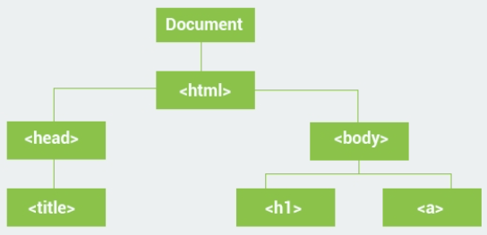

# The DOM

When you open any webpage in a browser, the HTML of the page is loaded and rendered visually on the screen.
To accomplish that, the browser builds the Document Object Model of that page, which is an object oriented model of its logical structure.

JavaScript can be used to manipulate the DOM of a page dynamically to add, delete and modify elements.
The DOM represents a document as a tree structure.
HTML elements become interrelated nodes in the tree.
All those nodes in the tree have some kind of relations among each other.
Nodes can have child nodes. Nodes on the same tree level are called siblings.



For the example above:

``` html
<html> has two children (<head>, <body>);
<head> has one child (<title>) and one parent (<html>);
<title> has one parent (<head>) and no children;
<body> has two children (<h1> and <a>) and one parent (<html>);
```

It is important to understand the relationships between elements in an HTML document in order to be able to manipulate them with JavaScript.

### The document Object

There is a predefined document object in JavaScript, which can be used to access all elements on the DOM.
In other words, the document object is the owner (or root) of all objects in your webpage.
So, if you want to access objects in an HTML page, you always start with accessing the document object.

For example:

``` js
document.body.innerHTML = "Some text";
```


As body is an element of the DOM, we can access it using the document object and change the content of the innerHTML property.
The innerHTML property can be used on almost all HTML elements to change its content.

### Selecting Elements


All HTML elements are objects. And as we know every object has properties and methods.
The document object has methods that allow you to select the desired HTML element.
These three methods are the most commonly used for selecting HTML elements:

``` js
//finds element by id
document.getElementById(id) 

//finds elements by class name
document.getElementsByClassName(name) 

//finds elements by tag name
document.getElementsByTagName(name)
```


In the example below, the getElementById method is used to select the element with id="demo" and change its content:

``` js
var elem = document.getElementById("demo");
elem.innerHTML = "Hello World!";
```


The example above assumes that the HTML contains an element with id="demo", for example `<div id="demo"></div>.`

The getElementsByClassName() method returns a collection of all elements in the document with the specified class name.
For example, if our HTML page contained three elements with class="demo", the following code would return all those elements as an array:

``` js
var arr =  document.getElementsByClassName("demo");
//accessing the second element
arr[1].innerHTML = "Hi";
```


Similarly, the getElementsByTagName method returns all of the elements of the specified tag name as an array.
The following example gets all paragraph elements of the page and changes their content:

``` js
<p>hi</p>
<p>hello</p>
<p>hi</p>
<script>
var arr = document.getElementsByTagName("p");
for (var x = 0; x < arr.length; x++) {
  arr[x].innerHTML = "Hi there";
}
</script>
```

The script will result in the following HTML:

``` js
<p>Hi there</p>
<p>Hi there</p>
<p>Hi there</p>
``` 

We used the length property of the array to loop through all the selected elements in the above example.

### Working with DOM

Each element in the DOM has a set of properties and methods that provide information about their relationships in the DOM:

+ element.childNodes returns an array of an element's child nodes.
+ element.firstChild returns the first child node of an element.
+ element.lastChild returns the last child node of an element.
+ element.hasChildNodes returns true if an element has any child nodes, otherwise false.
+ element.nextSibling returns the next node at the same tree level.
+ element.previousSibling returns the previous node at the same tree level.
+ element.parentNode returns the parent node of an element.

We can, for example, select all child nodes of an element and change their content:

``` html
<html>
     <body>
            <div id="demo">hi
               <p>hi</p>
               <p>hello</p>
            </div>
            <script>
                   var a = document.getElementsById("demo");
	             var arr = a.childNodes;
                   for (var x = 0; x < arr.length; x++) {
                        arr[x].innerHTML = "Hi there";
                   }
             </script>
    </body>
</html>
```


### Changing Elements

Once you have selected the element(s) you want to work with, you can change their attributes.
As we have seen in the previous lessons, we can change the text content of an element using the innerHTML property.
Similarly, we can change the attributes of elements.
For example, we can change the src attribute of an image:

``` html

<script>
var el = document.getElementById("myimg");
el.src = "apple.png";
</script>
```


We can change the href attribute of a link:

``` html
<a href="http://www.google.com/">Some URL</a>
<script>
var el=document.getElementByTagName("a");
el[0].href="http://myurl.com/";
</script>
```

The style of HTML elements can also be changed using JavaScript.
All style attributes can be accessed using the style object of the element.
All CSS properties can be set and modified using JavaScript. Just remember, that you cannot use dashes (-) in the property names: these are replaced with camelCase versions, where the compound words begin with a capital letter.
For example: the background-color property should be referred to as backgroundColor.

``` html
<div id="demo" style="width:200px"> Some text</div>
<script>
var el = document.getElementById("demo");
el.style.color = "6600FF";
el.style.width = "100px";
</script>
```


### Creating Elements

Use the following methods to create new nodes:

+ element.cloneNode() clones an element and returns the resulting node.
+ document.createElement(element) creates a new element node.
+ document.createTextNode(text) creates a new text node.

``` html
var node = document.createTextNode("Some new text");
```


This will create a new text node, but it will not appear in the document until you append it to an existing element with one of the following methods:

+ element.appendChild(newNode) adds a new child node to an element as the last child node.
+ element.insertBefore(node1, node2) inserts node1 as a child before node2.

``` html
<div id="demo"> Some Text </div>
<script>
    //create a new paragraph
    var p = document.createElement("p");
    var node = document.createTextNode("Some new text");
    //adding the text to paragraph
    p.appendChild(node);
    
    var div = document.getElementById("demo");
    //adding  the paragraph  to the div 
    div.appendChild(p);
</script>
```


To remove an HTML element, you must select the parent of the element and use the removeChild(node) method.
An alternative way of achieving the same result would be the use of the parentNode property to get the parent of the element we want to remove:

``` html
var child = document.getElementById("p1");
child.parentNode.removeChild(child);
```

To replace an HTML element, the element.replaceChild(newNode, oldNode) method is used.

### Animations

To create an animation, we need to change the properties of an element at small intervals of time. We can achieve this by using the setInterval() method, which allows us to create a timer and call a function to change properties repeatedly at defined intervals (in milliseconds).

For example:

``` js
var t = setInterval(move, 500); 
```

This code creates a timer that calls a move() function every 500 milliseconds.
Now we need to define the move() function, that changes the position of the box.

``` js
// starting position
var pos = 0; 
//our box element
var box = document.getElementById("box");

function move() {
  pos += 1;
  box.style.left = pos+"px"; //px = pixels
}
```


The move() function increments the left property of the box element by one each time it is called.

The following code defines a timer that calls the move() function every 10 milliseconds:

``` js
var t = setInterval(move, 10);
```

However, this makes our box move to the right forever. To stop the animation when the box reaches the end of the container, we add a simple check to the move() function and use the clearInterval() method to stop the timer.

``` js
function move() {
  if(pos >= 150) {
    clearInterval(t);
  }
  else {
    pos += 1;
    box.style.left = pos+"px";
  }
}
```

When the left attribute of the box reaches the value of 150, the box reaches the end of the container, based on a container width of 200 and a box width of 50.

